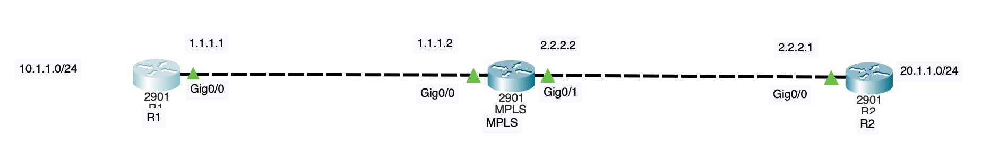
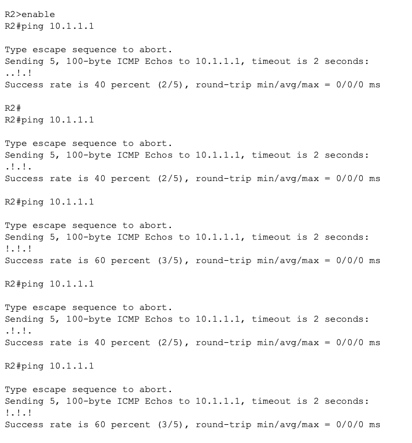
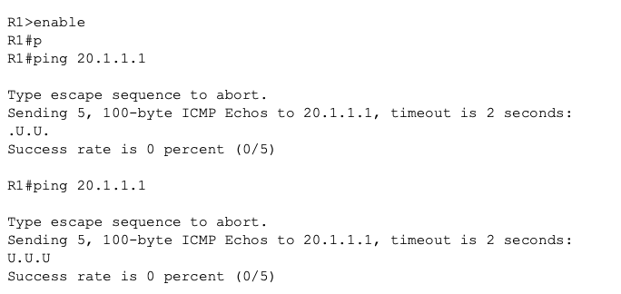
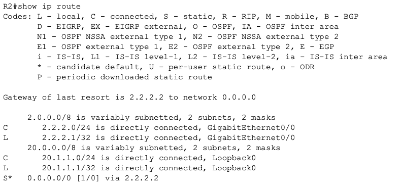
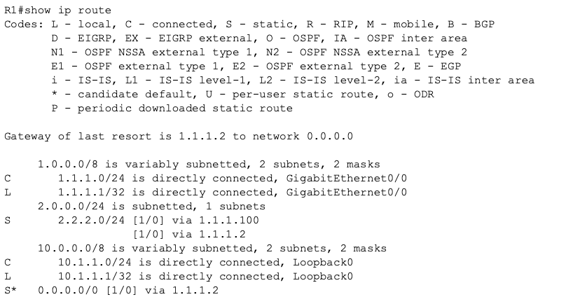
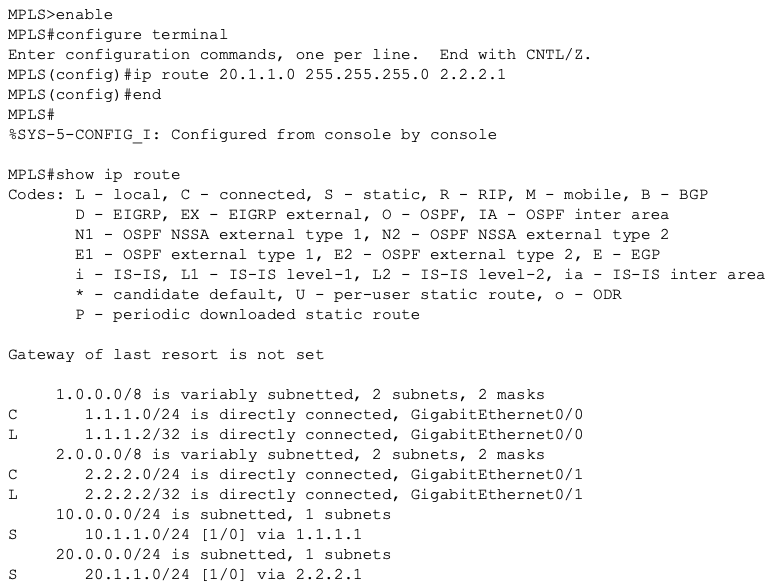
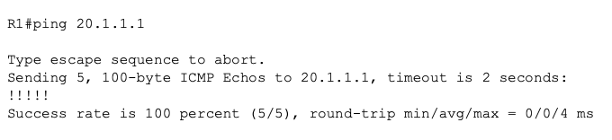

# V1 — My First Troubleshooting Investigation

## Where I started

I found this lab difficult because I was learning the networking basics while trying to solve it. Routing tables, subnet masks, ARP and ping source addresses were not concepts I could confidently connect together yet.

I used Claude extensively as a tutor. It explained concepts, helped me interpret output and suggested where to look next. I ran the commands myself, wrote predictions before tests and came up with the idea that packets might be taking one correct path and one incorrect path. When something did not make sense, I asked more questions and tested again.

I wrote this log afterwards from my notes. The short outputs below show the patterns I recorded, rather than complete terminal sessions.

## My setup



| Device | Internal endpoint | Connection to the provider |
|---|---|---|
| R1 — Site A | `10.1.1.1` in `10.1.1.0/24` | R1 `1.1.1.1`; provider `1.1.1.2` |
| R2 — Site B | `20.1.1.1` in `20.1.1.0/24` | R2 `2.2.2.1`; provider `2.2.2.2` |

I used router interface addresses to represent the internal endpoints. The middle router was named `MPLS`, but I was troubleshooting its IP routes.

## 1. I checked the links and reproduced the problem

The links looked operational in Packet Tracer. I then ran:

```text
R2# ping 10.1.1.1
```

I ran the test five times. The success rates were 40%, 40%, 60%, 40% and 60%, as shown below.



At first, I did not understand why the result kept changing. Looking at the individual replies helped more than looking at the percentage. After the first run, I saw alternating patterns:

```text
.!.!.
!.!.!
```

I learned that `!` meant a reply arrived and `.` meant a timeout. The repeated alternation made me think of a delivery person taking the correct road once, then the wrong road next time.

**My hypothesis:** Somewhere in the network, traffic might be split between a working next hop and a failing next hop.

## 2. I tested from R1 as well

After testing from R2, I ran the reverse-direction test from R1 to compare the behaviour:

```text
R1# ping 20.1.1.1
.U.U.
Success rate is 0 percent (0/5)

R1# ping 20.1.1.1
U.U.U
Success rate is 0 percent (0/5)
```

Both attempts failed completely. I learned that `U` meant an ICMP destination-unreachable message was received, while `.` meant a timeout.



I now had two different symptoms: R2's ping to `10.1.1.1` partly succeeded, while R1's ping to `20.1.1.1` failed every time. I wanted to understand why. Each ping needed a request and a reply, so I could not locate the fault from these results alone. I continued by checking R2's route for the intermittent test.

## 3. I checked whether R2 had two paths

```text
R2# show ip route
```



I found no specific route to `10.1.1.1`. R2 used this default route toward the provider:

```text
S* 0.0.0.0/0 [1/0] via 2.2.2.2
```

The table also showed `2.2.2.1` on GigabitEthernet0/0 and `20.1.1.1` on Loopback0. These were two addresses on R2, not two competing next hops to Site A.

That did not support my idea of two competing routes on R2. I kept the hypothesis, but needed to look elsewhere in the packet's journey.

## 4. I learned why the ping source mattered

I initially thought that a ping from R2 automatically used Site B's internal address. AI pointed out another possibility: the standard ping could be using R2's outgoing interface address, `2.2.2.1`, instead of `20.1.1.1`. I had not recognised this myself.

With that explanation, I understood the address pair used by the standard ping:

| Packet | Source | Destination |
|---|---|---|
| My standard ping request | `2.2.2.1` | `10.1.1.1` |
| Its reply | `10.1.1.1` | `2.2.2.1` |

R2 was using its outgoing interface address. I therefore needed to check how R1 reached `2.2.2.1`, rather than assuming the reply was going to `20.1.1.1`.

I wanted to explicitly select the Site B internal address, so I tried:

```text
R2# ping 10.1.1.1 source 20.1.1.1
% Invalid input detected at '^' marker.
```

The `^` marker pointed to `source`. I learned that this Packet Tracer router did not accept that inline syntax. The command was rejected before any ping probes were sent, so this was not a connectivity result. I needed to use interactive extended ping to select the source address.

To complete the source-specific test, I used interactive extended ping. I entered `ping` on its own, enabled extended commands and explicitly selected `20.1.1.1` as the source:

```text
R2# ping
Protocol [ip]:
Target IP address: 10.1.1.1
Repeat count [5]:
Datagram size [100]:
Timeout in seconds [2]:
Extended commands [n]: y
Source address or interface: 20.1.1.1
```

I accepted the other defaults.

**My question:** Would explicitly using the internal Site B address change the result?

**My result:**

```text
Packet sent with a source address of 20.1.1.1
.....
Success rate is 0 percent (0/5)
```

The output confirmed that I was now testing from `20.1.1.1`. All five probes timed out, compared with the partial success of the standard ping. Changing the source also changed the destination of the replies, so I needed to investigate both return destinations. The timeout alone did not tell me where the packets were lost.

## 5. I found two return routes on R1

```text
R1# show ip route
```



I found two next hops for the same static route, both with `[1/0]`:

```text
S  2.2.2.0/24 [1/0] via 1.1.1.100
             [1/0] via 1.1.1.2
```

R1 also had a default route through `1.1.1.2`, but the more specific `2.2.2.0/24` route matched replies to `2.2.2.1`. The valid default route therefore did not avoid the incorrect next hop.

I recognised `1.1.1.2` as the provider's address, but no device in my lab topology used `1.1.1.100`. I tested that next hop directly:

```text
R1# ping 1.1.1.100
.....
Success rate is 0 percent (0/5)
```

I received no replies. Together with the topology and routing table, this supported my conclusion that the static route through `1.1.1.100` was incorrect.

The incorrect route had the same administrative distance and metric as the valid route through `1.1.1.2`. In this Packet Tracer lab, replies were distributed between the valid and invalid next hops, explaining the alternating success and timeout pattern. This matched my two-path hypothesis; I learned that equal-cost routing does not always alternate individual packets on real equipment.

**My prediction:** If I removed only the incorrect route, the original ping should stop alternating.

## 6. I removed the incorrect route and tested again

On R1, I entered:

```text
configure terminal
no ip route 2.2.2.0 255.255.255.0 1.1.1.100
end
show ip route
```

I checked the routing table after the change. The route through `1.1.1.100` was gone, and the only next hop for `2.2.2.0/24` was the provider at `1.1.1.2`:

```text
S  2.2.2.0/24 [1/0] via 1.1.1.2
```

I repeated the standard R2 ping. The repeated test returned:

```text
!!!!!
```

The original symptom was fixed for the standard ping. I still needed to investigate the failed tests involving `20.1.1.1`, because this successful retest used `2.2.2.1` as its source.

## 7. I checked the internal Site B route

For my earlier extended ping, the reply needed to reach `20.1.1.1`. I checked the provider's routing table:

```text
MPLS# show ip route
```

I found no matching route to that address and no usable default route. The provider could reach R2's WAN network directly, but did not know how to reach the internal Site B network. This also explained why my earlier R1 ping to `20.1.1.1` failed: the provider needed this route to forward the request. For the extended ping from R2, it needed the same route to forward the reply.

**My prediction:** Adding a route to `20.1.1.0/24` through R2 should allow the reply to return.

## 8. I added the missing route and checked the routing table

On the provider router labelled `MPLS`, I entered:

```text
MPLS> enable
MPLS# configure terminal
MPLS(config)# ip route 20.1.1.0 255.255.255.0 2.2.2.1
MPLS(config)# end
MPLS# show ip route
```



The routing table confirmed that the new static route was installed:

```text
S    20.1.1.0/24 [1/0] via 2.2.2.1
```

The next hop, `2.2.2.1`, was R2's provider-facing interface. The table also showed `2.2.2.0/24` as directly connected and the existing route to Site A, `10.1.1.0/24`, through `1.1.1.1`. The provider now had routes to both internal site networks.

`Gateway of last resort is not set` was still displayed. A default route was not required for these two destinations because the specific routes matched them.

According to my test notes, I repeated the extended ping from `20.1.1.1` to `10.1.1.1`, and it succeeded. The screenshot above confirms the configuration change and installed route; it does not show that ping result.

I also repeated R1's ping to `20.1.1.1`, which had failed earlier with `U.U.U`. With both fixes in place, it now succeeded:

```text
R1# ping 20.1.1.1
!!!!!
Success rate is 100 percent (5/5)
```



## My result and next step

I resolved two separate faults: an incorrect route on R1 and a missing route on the provider. The most useful lesson was understanding why changing the source changed the return path I was testing.

I still needed a lot of help during this first attempt. My next step was to revisit the lab independently and use the OSI model to organise my reasoning.
